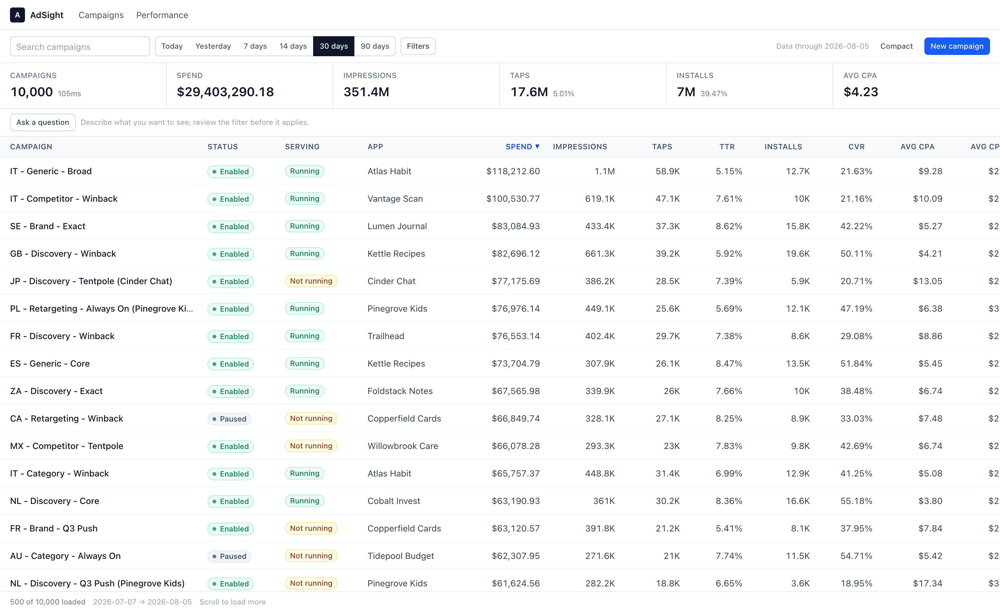
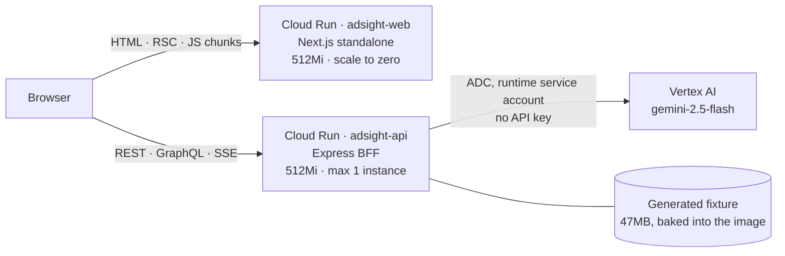
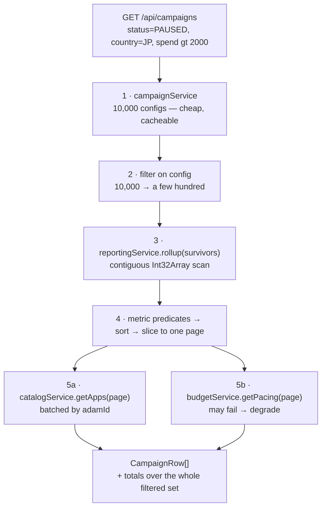
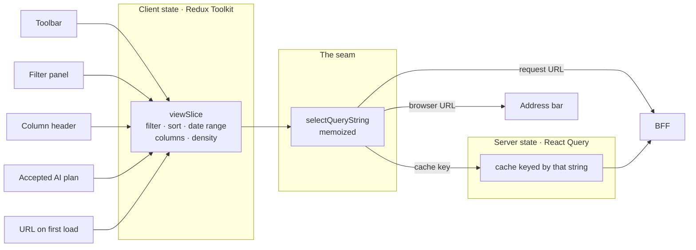
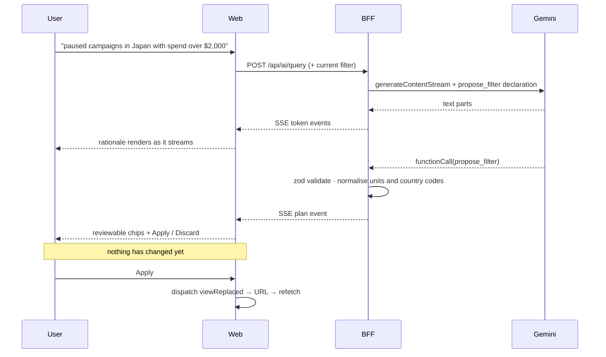
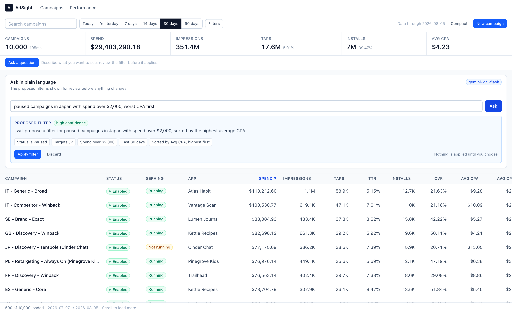
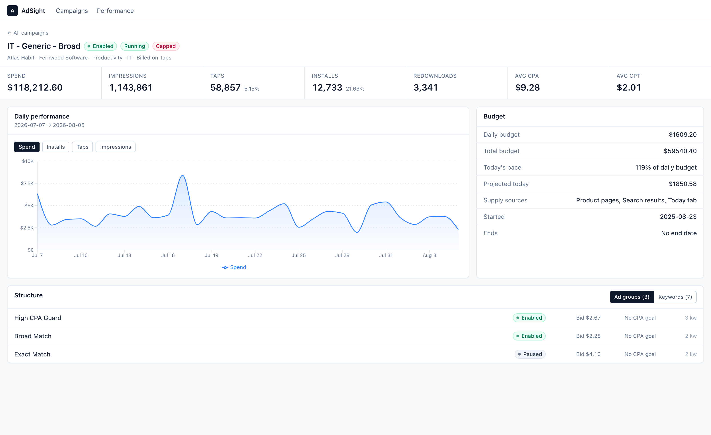
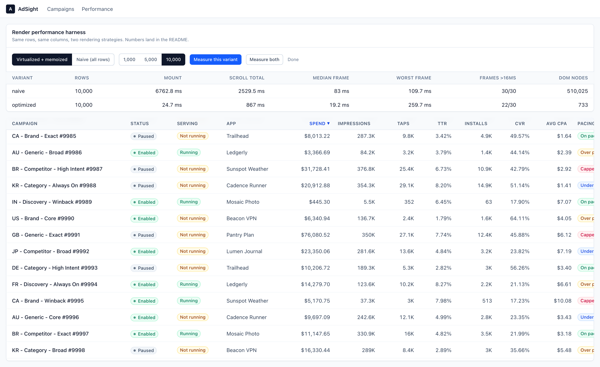

# AdSight

**An ad campaign performance dashboard over 10,000 campaigns.** Browse and filter a
large table, drill into a campaign, and ask questions in plain language.

**Live:** https://adsight-web-p7zkgdrfpa-uc.a.run.app · **API:** https://adsight-api-p7zkgdrfpa-uc.a.run.app/health

The domain vocabulary follows the Apple Search Ads Campaign Management API —
supply sources, serving state reasons, tap-through rate, billing events — so the
surface is recognisable if you have used that product. The data is generated;
the engineering is not.



---

## What is actually built

| | |
|---|---|
| **Monorepo** | Turborepo + npm workspaces. Two apps, two shared packages, a real build graph — `apps/web` cannot compile until `packages/*` are built. |
| **BFF** | Express 5 service that fans out to four simulated upstreams, joins them, and shapes one payload for the UI. Serves **both REST and GraphQL** over the same aggregator. |
| **Large table** | 10,000 rows, virtualized and memoized. Server-side filter, sort and pagination; infinite scroll. Measured against a deliberately naive implementation. |
| **State** | React Query for server state, Redux Toolkit for client state, joined by a single selector that is simultaneously the cache key, the request URL, and the browser URL. |
| **AI query bar** | Natural language → a *proposed* filter, streamed token by token over SSE, shown as reviewable chips. Nothing applies until the user accepts. |
| **Deployment** | Both services containerised on Google Cloud Run. One script, `./deploy/gcp-deploy.sh`. |
| **Tests** | 135 unit (Vitest + RTL) and 10 end-to-end (Playwright), running in GitHub Actions on every PR. |

Deliberately **not** built: auth, billing, multi-tenancy, or writes beyond
creating a campaign. Scope was kept small so the parts that exist are finished.

---

## System design

### Deployment topology

Two Cloud Run services. The browser talks to both: it loads the app from one and
calls the API on the other directly, which is why CORS exists here and why the
API's URL is baked into the web bundle at build time.



`--max-instances=1` on the API is deliberate and not a cost measure: campaigns
created through the UI live in an in-memory array, so a second instance would
serve a 404 for a campaign that was just created.

### The BFF request pipeline

This is the part worth reading. One client request becomes a fan-out across four
upstreams, and the **ordering** decides how much work the expensive ones do.



Steps 1–4 are why a metric threshold across 10,000 campaigns is affordable —
reporting only ever rolls up rows that already survived the cheap predicates.
Step 5 is why a 50-row page costs two batched upstream calls instead of a
hundred. A filtered query returns in **~5 ms**, an unfiltered one in **~30 ms**.

**Partial failure is a first-class path.** The budget service fails 6% of the
time by default. The aggregator catches that specific error, returns
`pacing: null` per row, and names the failure in `meta.degraded` so the UI shows
a banner instead of an error page. Anything that is *not* an
`UpstreamUnavailableError` is rethrown as a 500 — a real bug must not be silently
downgraded to a missing column, and a test asserts that distinction.

### Why the state is split the way it is

**Redux holds the question; React Query holds the answer.**



Filters, sort, date range and table config are **client state**: nothing on the
server owns them, they are edited from five disconnected places, and several have
to be read *together* to build one request. Component state would mean
prop-drilling through the table; React Query would mean storing user intent in a
cache that is allowed to evict it.

Campaign lists, details and facets are **server state**: the problems they bring
are caching, deduplication, background refetch, pagination and cancellation — all
of which React Query solves and none of which a reducer does.

Three consequences fall out of the single seam:

- Changing a filter creates a **new cache entry** rather than an imperative
  refetch, so going back to a previous filter is instant.
- Opening the filter panel or changing density produces the **same string**, so
  React Query does not refetch. There is a test asserting exactly this.
- A filtered view is a **shareable link**, and the URL the browser writes is
  parsed by the server with [the same codec](packages/types/src/querystring.ts) —
  so the address bar, the cache and the server cannot disagree.

### The AI query bar

The model never mutates the view. It proposes; a person accepts.



Three details make the review real rather than decorative:

1. The chips are derived from the **same filter object** that will be applied, so
   the preview cannot drift from the effect.
2. `unsupported` is shown as prominently as the chips. A planner that quietly
   drops half a request is worse than one that says it could not do it.
3. Accepting dispatches the **same action** URL hydration uses, so an AI-applied
   filter is indistinguishable from a hand-built one — including in the URL.



Ask *"which campaigns are wasting money in Europe?"* and it expands Europe to 30
country codes, sorts by spend, and returns **low confidence** with
*"'wasting money' is subjective and cannot be quantified without specific
thresholds"*. That is the behaviour the review step exists for.

---

## Screenshots

| Campaign drill-in | Performance harness |
|---|---|
|  |  |

The drill-in lazily loads Recharts — the only route that does. The harness at
`/perf` mounts both table implementations over the same rows and times them; the
figures in that screenshot are one live run, so they differ slightly from the
median-of-5 table below.

---

## Measured performance

From `perf/render.json` and `perf/bundle.json`, regenerated by `npm run perf` and
`npm run measure:bundle`. Median of 5 runs, headless Chromium, production build.

### Table rendering, 10,000 rows

`CampaignTableNaive` is the natural first version: every row in the DOM, no
memoization, `new Intl.NumberFormat(...)` per cell, one `<circle>` per sparkline
point. `CampaignTable` adds virtualization, `React.memo` on the row, module-level
cached formatters, a fixed row height, and a single `<path>` sparkline.

| | Naive | Virtualized + memoized | |
|---|---:|---:|---|
| Mount to painted frame | 6,472 ms | **34 ms** | 190× |
| Scripted scroll, 30 frames | 2,063 ms | **501 ms** | 4.1× |
| Median frame | 68.1 ms | **17.5 ms** | 3.9× |
| Worst frame | 95.1 ms | **23.9 ms** | 4.0× |
| DOM elements | 510,025 | **463** | 1,100× |

Two caveats worth stating. The optimized scroll figure is **bounded by the
display refresh rate**, not by the work — 30 frames at 16.7 ms is 501 ms, exactly
what it reports — so 4.1× is a floor, not a measurement of headroom. And the
naive mount number moves ±15% with machine load while the optimized one does
not, because it renders a constant ~25 rows regardless of dataset size. **That
constant-cost property is the actual result:** at 1,000 rows naive mounts in
583 ms and optimized in 33 ms; at 10,000 naive is 11× slower again and optimized
is unchanged.

### Initial JavaScript

| Route | JS transferred | Contains Recharts |
|---|---:|---|
| `/` (campaign list) | 518 KB | no |
| `/campaigns/[id]` (drill-in) | 903 KB | yes, 376 KB |

**This started out wrong, and measuring is what found it.** The first version
routed all three deferred panels through a single `lazy.tsx` barrel.
`next/dynamic` correctly deferred *executing* Recharts, but because the campaign
list imported that barrel for the AI panel — and the barrel also referenced the
chart — the chart chunk was registered against the list route too. Splitting the
barrel into one module per component took `/` from **253 KB to 151 KB gzip**, a
40% reduction on the landing route, for a change that is purely file
organisation.

I would not have found it by reading the code: `next/dynamic` was in the right
place and the intent was correct. It surfaced because the before/after came out
at **+0.1%**, which was implausible enough to investigate. Write-up:
[`apps/web/src/components/lazy/README.md`](apps/web/src/components/lazy/README.md).

The corollary, stated plainly: **applying `next/dynamic` to my own small
components measured as no change at all** (150.8 vs 150.9 KB gzip). Deferring
them is tidy but it is not a performance result, and this repo does not claim it
as one. The win was entirely in keeping one heavy third-party dependency off a
route that never uses it.

---

## REST and GraphQL over one aggregator

Both surfaces call the same orchestration. The difference is field-level
laziness: `app` and `pacing` resolve as thunks, so a GraphQL query selecting only
name and spend never touches the catalog or budget upstreams, while the
equivalent REST call always does — its response shape is fixed. Per-request batch
loaders collapse a 25-row page into one catalog call rather than 25.

Both claims are asserted with spies in
[`graphql.test.ts`](apps/api/src/graphql/graphql.test.ts), because the response
body looks identical either way.

```bash
curl -s -X POST $API/graphql -H 'Content-Type: application/json' \
  -d '{"query":"{ campaigns(limit:3){ rows{ campaign{name} metrics{ localSpend } } } }"}'
```

---

## Tests

135 unit tests and 10 end-to-end, all run in CI on every PR.

```bash
npm test        # vitest across all workspaces
npm run e2e     # playwright; builds and starts both servers itself
```

| Where | What |
|---|---|
| `apps/api` (85) | date-range resolution, two-pass filtering, unit conversion, divide-by-zero rates, upstream degradation, REST integration against the real fixture, GraphQL laziness and batching, the heuristic planner, model-output validation |
| `apps/web` (32) | reducer behaviour, the query-string seam, URL codec round-trip, virtualization row counts, table accessibility, the AI review gate |
| `packages/ui` (18) | formatter caching, sparkline path generation and degenerate cases |
| `e2e` (10) | filter → shareable URL → drill in → create campaign, plus propose-and-apply and propose-and-discard |

### Bugs these caught

- **An unbounded render loop on page load.** `CreateCampaignDialog` had the object
  returned by `useMutation` in an effect dependency array and called
  `mutation.reset()` inside it. New identity every render → effect re-runs →
  reset notifies → repeat. The dialog stays mounted while closed, so it fired
  immediately and starved the URL-sync effect; no filter ever reached the address
  bar. Depending on `mutation.reset`, which is stable, fixes it.
- **`aria-sort` on the wrong element.** It sat on the header `<button>`, whose
  implicit role does not support it, so sort state was never announced. The table
  is now a real ARIA grid with `aria-rowcount` reporting the *full* result size —
  otherwise virtualization makes a screen reader say "row 12 of 25" on a
  10,000-row set.
- **A route that 404'd only in production.** `.gcloudignore` used a bare `perf`
  to exclude measurement artifacts; gitignore semantics matched *any* directory
  of that name, including `apps/web/src/app/perf/`. The route source never
  reached Cloud Build. Nothing errored — the file simply was not there.
- **`$2,000` became `$200,000`.** The metric enum is named `spendCents` while the
  schema asks for dollars, and the model converted to the unit in the field name.
  A 100× filter error returning plausible-looking rows.
- **`UK` matched zero campaigns.** It passes a two-letter shape check, but the ISO
  code is `GB`. Reads to a user as the AI being wrong.

---

## Running it locally

```bash
npm install
npm run seed     # generates the 10,000-campaign fixture (~1.5s, deterministic)
npm run dev      # api on :4000, web on :3000
```

The seed step is required — the API refuses to boot without it rather than
serving an empty dashboard. `apps/api/data/` is gitignored: the generator is
deterministic given `(SEED, SEED_END_DATE)`, so CI regenerates the 18 MB metrics
file in about a second instead of the repo carrying it.

Daily metrics are stored as a flat `Int32Array` in a binary file rather than
JSON. 10,000 campaigns × 90 days × 5 counters is 4.5M numbers: as JSON that is
~40 MB to parse every boot; as Int32 it is an 18 MB read plus a zero-copy view.
It also makes a date-range rollup a contiguous scan, which is the property the
list endpoint depends on.

### The AI planner

Works with no configuration — a built-in keyword parser answers, and the
streaming, chips and Apply/Discard behave identically. To use Gemini instead:

- `VERTEX_PROJECT_ID` — Vertex AI, authenticated with Application Default
  Credentials. **No API key exists anywhere**; on Cloud Run it is the runtime
  service account.
- `GEMINI_API_KEY` — an AI Studio key, which has a free tier and needs no GCP
  project.

`/api/ai/status` reports which planner is live and the UI labels the panel.

---

## Deploying

```bash
gcloud config set project YOUR_PROJECT_ID
./deploy/gcp-deploy.sh
```

Cloud Run rather than a serverless-function host because this app needs real
long-lived processes: created campaigns live in memory and the query endpoint
streams SSE. [DEPLOY.md](DEPLOY.md) covers the rest, including the build-time API
URL that fixes the deploy order, why builds go through Cloud Build (Apple Silicon
produces arm64 images that deploy fine and then fail to start), and the
`npm prune` subtlety that had the API image at 1.12 GB before it was scoped to
one workspace — 539 MB of `node_modules` for a service that imports Express,
GraphQL, zod and the Gemini SDK. Scoping it brought that to 21 MB.

---

## Known limitations

- `POST /api/ai/query` has no authentication or rate limit. Vertex removes the
  leaked-key risk but not the open-endpoint one.
- The upstreams are in-process fixtures behind a swappable client interface, not
  real services.
- The `GEMINI_API_KEY` path is implemented but untested — same SDK constructor as
  the Vertex path, so the risk is low, but it has not been exercised.
- Date presets resolve against the fixture's last day rather than the wall clock,
  so "last 7 days" stays meaningful as the data ages. The footer shows the window
  on screen.
